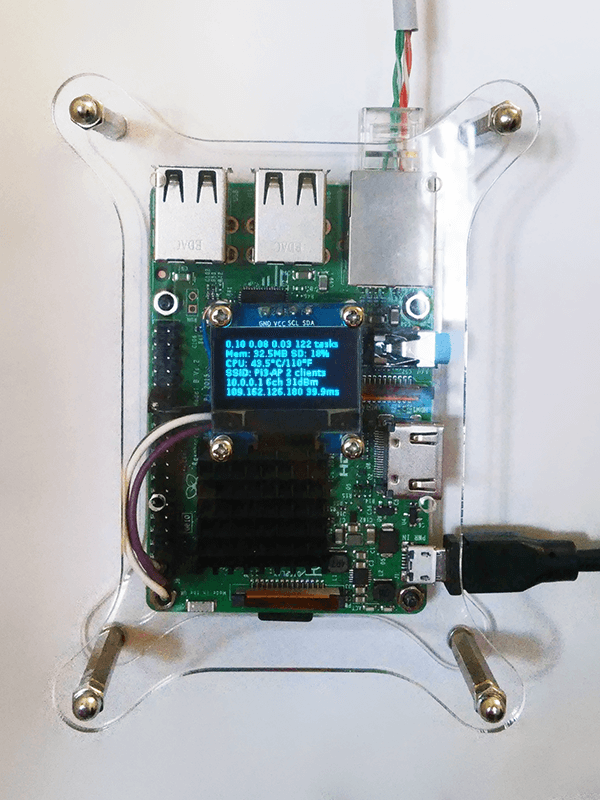

# Access point on Raspberry Pi 3 with parameter display

Access point (AP) on Raspberry Pi 3 (RPi) with OLED display (SSD1306 128x64 I2C or SPI).

## Equipment

1. Raspberry Pi 3 (OS Raspbian Jessie Lite)
2. OLED 0.96" 128×64 I2C SSD1306
3. OLED 0.96" 128×64 SPI SSD1306



## AP

1\. Install [Raspbian Jessie Lite](https://www.raspberrypi.org/downloads/raspbian/) on microSD card using Win32DiskImager utility.

2\. Make a file-semaphore 'ssh' into root directory.

3\. Plug RPi to your router and use ipscan24 utility for search the board IP.

4\. Use with Putty utility to connect RPi by SSH with default login and password:

```
putty.exe pi@<RPi IP> -pw raspberry
```

5\. Change default password:

```
sudo passwd pi
```

6\. Update software:

```
sudo apt-get update && sudo apt-get upgrade
```

7\. Configure network interfaces:

```
sudo nano /etc/network/interfaces
```

And add lines into the file:

```
auto lo
iface lo inet loopback

auto eth0
allow-hotplug eth0
iface eth0 inet manual

auto wlan1
allow-hotplug wlan1
iface wlan1 inet manual
wpa-conf /etc/wpa_supplicant/wpa_supplicant.conf

allow-hotplug wlan0
iface wlan0 inet static
address 10.0.0.1
network 10.0.0.0
netmask 255.255.255.0
broadcast 255.0.0.0
```

To save changers use Ctrl+O and to exit — Ctrl+X.

8\. Install dnsmasq:

```
sudo apt-get install dnsmasq
```

9\. Configure DNS:

```
sudo nano /etc/dnsmasq.conf
```

And add lines into the file:

```
# disables dnsmasq reading any other files like /etc/resolv.conf for nameservers
no-resolv
# Interface to bind to
interface=wlan0
# except-interface=wlan1
except-interface=eth0
# Specify starting_range,end_range,lease_time
#address=/#/10.0.0.1
dhcp-range=10.0.0.3,10.0.0.20,12h
# dns addresses to send to the clients
server=8.8.8.8
server=8.8.4.4
log-facility=/var/log/dnsmasq.log
log-queries
```

10\. Enable packet forwarding:

```
sudo nano /etc/sysctl.conf
```

And add lines into the file:

```
net.ipv4.ip_forward=1
net.ipv6.conf.all.forwarding=1
```

11\. Configure a NAT between our wlan0 interface and our eth0 interface:

```
sudo nano /etc/rc.local
```

And add lines into the file:

```
SOURCE=eth0
DEST=wlan0
iptables -t nat -A POSTROUTING -o $SOURCE -j MASQUERADE
iptables -A FORWARD -i $SOURCE -o $DEST -m state --state RELATED,ESTABLISHED -j ACCEPT
iptables -A FORWARD -i $DEST -o $SOURCE -j ACCEPT
exit 0
```

12\. Install hostapd:

```
sudo apt-get install hostapd
```

13\. Add config for use Wi-Fi card as an AP:

```
sudo nano /etc/default/hostapd
```

And add lines into the file:

```
DAEMON_CONF="/etc/hostapd/hostapd.conf"
```

14\. Configure AP:

```
sudo nano /etc/hostapd/hostapd.conf
```

And add lines into the file (change a password):

```
# This is the name of the WiFi interface we configured above
interface=wlan0
# Use the nl80211 driver with the brcmfmac driver
driver=nl80211
# This is the name of the network
ssid=Pi3-AP
# Use the 2.4GHz band
hw_mode=g
# Use channel 6
channel=6
# Enable 802.11n
ieee80211n=1
# Enable WMM
wmm_enabled=1
# Enable 40MHz channels with 20ns guard interval
ht_capab=[HT40][SHORT-GI-20][DSSS_CCK-40]
# Accept all MAC addresses
macaddr_acl=0
# Use WPA authentication
auth_algs=1
# Require clients to know the network name
ignore_broadcast_ssid=0
# Use WPA2
wpa=2
# Use a pre-shared key
wpa_key_mgmt=WPA-PSK
# The network passphrase
wpa_passphrase=raspberry
# Use AES, instead of TKIP
rsn_pairwise=CCMP
```

15\. Reboot OS:

```
sudo reboot
```

16\. Find a new Pi3-AP and connect to it.

## OLEDs

1\. Connect OLED's to Raspberry Pi as shown on the picture.


| RPi         | I2C OLED      |
| ----------- | ------------- |
| GPIO3 (5)   | SCK           |
| GPIO2 (3)   | SDA           |
| 3V3 (1)     | VCC           |
| GND (6)     | GND           |

| RPi         | SPI OLED      |
| ----------- | ------------- |
| GPIO25 (22) | RES           |
| GPIO9 (21)  | D/C           |
| GPIO10 (19) | DIN (SDA)     |
| GPIO8 (24)  | CS            |
| GPIO11 (23) | CLK           |
| 3V3 (17)    | VCC           |
| GND (20)    | GND           |

2\. Anable hardware SPI or/and I2C

```
sudo raspi-config
```

Choose menu "5 Interfacing Options " and submenu "P4 SPI" or/and "P5 I2C". And finish configuration utility.

3\. Install packages for Python 3:

```
sudo apt-get install build-essential python-dev python-pip python-imaging python-smbus git
sudo apt-get install python3-pip python3-dev
```

4\. Install install the RPi.GPIO library:

```
sudo pip3 install RPi.GPIO
```

5\. Download and compile the JPEG library:

```
wget http://www.ijg.org/files/jpegsrc.v8c.tar.gz    
tar xvfz jpegsrc.v8c.tar.gz
cd jpeg-8c
./configure --enable-shared --prefix=$CONFIGURE_PREFIX
make
sudo make install
cd ..
```

6\. Link the libraries correctly:

```
sudo ln -s /usr/lib/arm-linux-gnueabi/libjpeg.so /usr/lib
sudo ln -s /usr/lib/arm-linux-gnueabi/libfreetype.so /usr/lib
sudo ln -s /usr/lib/arm-linux-gnueabi/libz.so /usr/lib
```

7\. Install rest of the libraries, as well as freetrype and zlib:

```
sudo apt-get install libjpeg-dev libfreetype6 libfreetype6-dev zlib1g-dev
```

8\. Install Python libraries for work with images and for retrieving information on running processes and system utilization:

```
sudo pip3 install image
sudo pip3 install psutil
```

9\. Inslall fonts:

```
sudo apt-get install fontconfig
```

10\. Clone library from Github for collecting system information and showing it on OLED, and install it:

```
git clone https://github.com/Oestoidea/Adafruit_Python_SSD1306.git
cd Adafruit_Python_SSD1306/
sudo python3 setup.py install
```

11\. Run example for your connection (I2C or SPI):

```
sudo python3 examples/statisticsI2C.py
```

Or:

```
sudo python3 examples/statisticsSPI.py
```

If all have done correctly you can see logs like:

```
1 1485124450.46 | 0.39 0.50 0.23 119 tasks | Mem: 34.8MB SD: 18% | CPU: 39.7°C/103°F | SSID: Pi3-AP 2 clients | 10.0.0.1 6ch 31dBm | 109.162.126.180 43.0ms
2 1485124451.71 | 0.39 0.50 0.23 119 tasks | Mem: 34.5MB SD: 18% | CPU: 39.7°C/103°F | SSID: Pi3-AP 2 clients | 10.0.0.1 6ch 31dBm | 109.162.126.180 43.0ms
3 1485124452.96 | 0.39 0.50 0.23 119 tasks | Mem: 34.8MB SD: 18% | CPU: 39.7°C/103°F | SSID: Pi3-AP 2 clients | 10.0.0.1 6ch 31dBm | 109.162.126.180 43.1ms
...
```

And information on the screen.

12\. Configure script autorun:

```
sudo nano /etc/rc.local
```

Add line at the and of the file (before "exit 0" line) for I2C display:

```
python3 /home/pi/Adafruit_Python_SSD1306/examples/statisticsI2C.py
```

Or for SPI display:

```
python3 /home/pi/Adafruit_Python_SSD1306/examples/statisticsSPI.py
```

13\. Reboot OS:

```
sudo reboot
```

# Authors

Tony DiCola

Vladimir Sokolov aka Oestoidea

# Licenses

The schematics are licensed under the [CC-BY-SA 3.0](http://creativecommons.org/licenses/by-sa/3.0/).

The source code are licensed under the [MIT](https://opensource.org/licenses/MIT), all text after must be included in any redistribution.

Python library to use SSD1306-based 128x64 or 128x32 pixel OLED displays with a Raspberry Pi or Beaglebone Black.

Designed specifically to work with the Adafruit SSD1306-based OLED displays ----> https://www.adafruit.com/categories/98

Adafruit invests time and resources providing this open source code, please support Adafruit and open-source hardware by purchasing products from Adafruit!

Written by Tony DiCola for Adafruit Industries.
